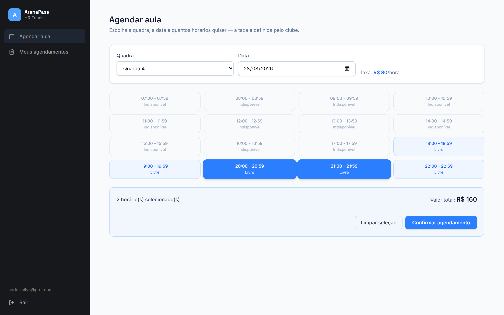
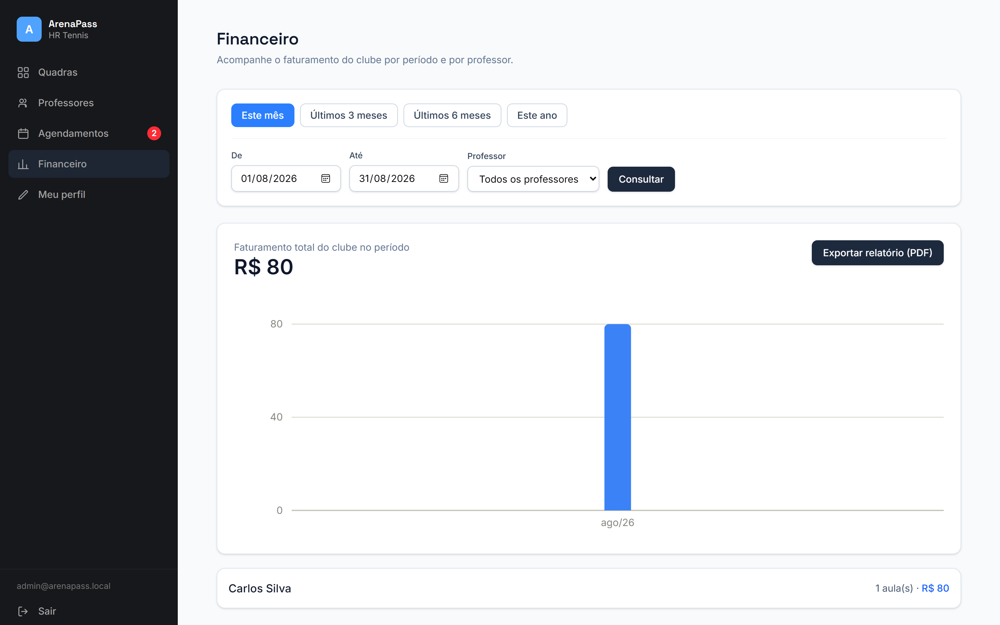
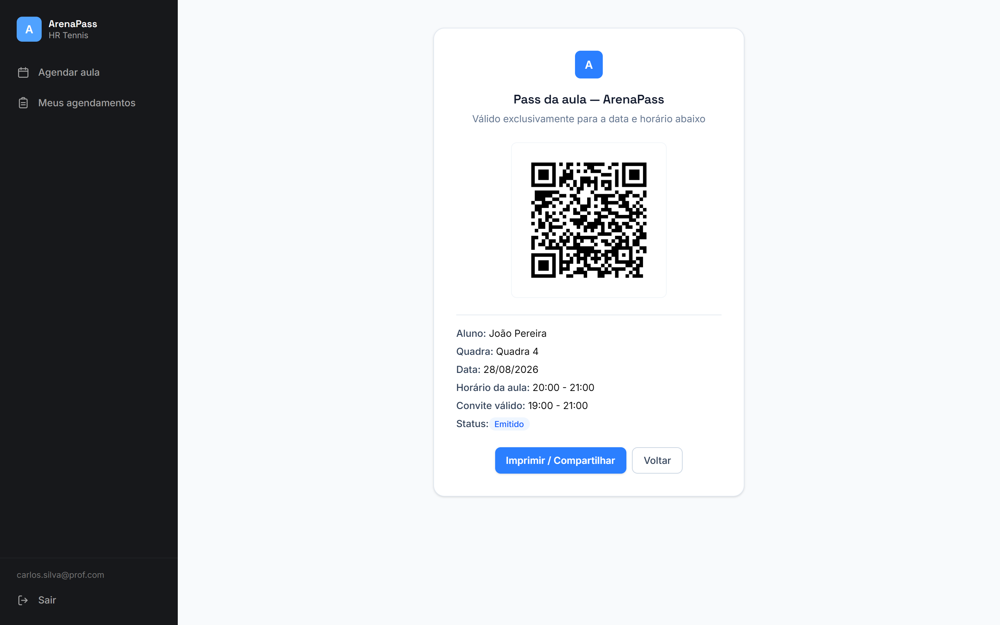

# ArenaPass

Sistema de gestão de quadras e docência terceirizada para clubes. O clube dedica uma quadra (hoje, Beach Tennis) exclusivamente a aulas de professores terceirizados: o professor agenda o horário, paga uma taxa fixa ao clube pelo uso da quadra e emite um convite digital (com QR Code) para o aluno não-sócio, válido apenas na janela da aula contratada.

🔗 **https://arenapass.wnlabs.com.br**

## Screenshots

| Agendamento | Financeiro | Convite com QR |
|---|---|---|
|  |  |  |

> _Screenshots em breve — salve as imagens em `docs/screenshots/`._

## Funcionalidades

- **Autenticação (JWT)** com três papéis: `Master`, `AdminClube` e `Professor`.
- **Cadastro de professor com verificação de e-mail**: o professor se autocadastra, recebe um código de 6 dígitos por e-mail (via Brevo) para confirmar o cadastro e só então o pedido entra como *pendente*, aguardando aprovação do clube.
- **Quadras e modalidades**: CRUD completo pelo admin (ou master), com horário de funcionamento, duração de slot e taxa por hora.
- **Agendamento**: professor escolhe quadra + data e vê a grade de horários livres; pode reservar múltiplos slots (não precisam ser contíguos) em uma única ação. Conflito de horário é bloqueado de verdade no banco (constraint de exclusão no Postgres), não só na aplicação. Não é possível agendar data/horário que já passou (calendário e grade de horários já refletem isso, com checagem também no backend). As listagens de agendamentos (professor e admin) são paginadas (10 por página).
- **Pagamento da taxa**: Pix (com geração real de BR Code/EMV, QR e copia-e-cola), cartão ou dinheiro — o próprio professor confirma o pagamento, ou o admin confirma manualmente. Assim que o horário da aula termina, o agendamento fica automaticamente encerrado: não dá mais pra confirmar pagamento nem cancelar, e não existe mais um passo manual de "marcar aula como realizada" — se foi pago e o horário passou, a aula é considerada dada.
- **Convite do aluno com QR Code**: gerado ao confirmar o agendamento; validado publicamente por token, com janela de validade de 1h antes do início da aula até o fim (ex: aula das 9h às 10h, convite vale das 8h às 10h — a tela do convite mostra essa janela real, não só o horário da aula). Não é possível emitir convite novo para uma aula cujo horário já passou. O admin/master também visualiza os convites emitidos de cada agendamento (aluno, CPF, status) direto na tela de Agendamentos, pra saber quem vai chegar no clube. **LGPD**: nas listagens o CPF do aluno aparece mascarado (`***.***.789-01`) e uma rotina em background anonimiza o CPF alguns dias após a aula (configurável via `Lgpd:RetencaoCpfConviteDias`, padrão 7).
- **Financeiro**: faturamento do clube por período, gráfico mês a mês e filtro por professor (mostrando quanto aquele professor especificamente gerou de receita ao clube).
- **Gestão de administradores**: o papel `Master` cria, edita e remove contas de `AdminClube` (protegido contra excluir o último admin restante) e tem acesso a tudo que o admin tem.
- **Perfil**: `AdminClube` e `Master` podem trocar o próprio e-mail/senha (exige senha atual).
- Sistema todo em **PT-BR**: datas em `dd/mm/aaaa`, moeda em real, locale `pt-BR` configurado globalmente no Angular.

## Papéis de usuário

| Papel | Acesso |
|---|---|
| `Master` | Tudo que `AdminClube` tem + criar/editar/excluir contas de admin |
| `AdminClube` | Quadras, professores, agendamentos, financeiro |
| `Professor` | Agendar horários, ver seus agendamentos, pagar taxa, emitir convite |

## Stack

- **Backend**: .NET 10, Clean Architecture (`Domain` / `Application` / `Infrastructure` / `Api`), CQRS com MediatR, FluentValidation, EF Core + Npgsql
- **Banco de dados**: PostgreSQL (Supabase, via connection pooler)
- **E-mail transacional**: Brevo (API REST) para o código de verificação de cadastro
- **Frontend**: Angular (standalone components, signals) + Tailwind CSS v4
- **Testes**: xUnit + EF Core InMemory (backend)
- **Fuso horário**: toda regra de negócio sensível a data/hora usa horário de Brasília (UTC-3 fixo, sem horário de verão) via `BrasilClock`, independente do fuso do servidor/container (o Render roda em UTC).

## Estrutura

```
backend/   API .NET (Clean Architecture: Domain, Application, Infrastructure, Api)
frontend/  App Angular
render.yaml            Blueprint de deploy da API no Render
backend/Dockerfile      Build da API para o Render
frontend/vercel.json    Config de build/rota do front no Vercel
```

## Rodando localmente

### Backend

1. Configure os segredos via user-secrets (nunca em `appsettings.json`):
   ```
   cd backend/src/ArenaPass.Api
   dotnet user-secrets set "ConnectionStrings:DefaultConnection" "<connection string do Postgres>"
   dotnet user-secrets set "Jwt:Secret" "<uma chave aleatória forte>"
   dotnet user-secrets set "Pix:Chave" "<sua chave Pix>"
   dotnet user-secrets set "Brevo:ApiKey" "<API key do Brevo>"
   dotnet user-secrets set "Brevo:RemetenteEmail" "<e-mail remetente verificado no Brevo>"
   ```
2. Rode a API — ela aplica migrations e faz o seed inicial. O espaço de demonstração (modalidades padrão, "Quadra 4", usuário admin de teste) só é semeado em `Development`; o usuário `Master` é semeado em qualquer ambiente, com a senha lida de `Seed:MasterPassword` (em `Development` há um valor padrão; fora de `Development` a API se recusa a iniciar sem essa variável definida):
   ```
   dotnet run --project backend/src/ArenaPass.Api
   ```
3. Swagger em `https://localhost:<porta>/swagger`.

### Testes do backend

```
cd backend
dotnet test
```

### Frontend

```
cd frontend
npm install
npm start
```

App em `http://localhost:4200`, apontando para a API local (`environment.development.ts`).

## Deploy

- **API**: [Render](https://render.com), via Docker (`backend/Dockerfile` + `render.yaml`) — `https://api-arenapass.wnlabs.com.br`
- **Frontend**: [Vercel](https://vercel.com) — `https://arenapass.wnlabs.com.br`
- **Banco**: Supabase (Postgres), acessado via connection pooler (modo *session*, porta 5432)
- **E-mail**: Brevo, domínio de envio próprio (`wnlabs.com.br`) com DKIM/DMARC configurados

Variáveis de ambiente necessárias no Render (ver `render.yaml`): `ConnectionStrings__DefaultConnection`, `Jwt__Secret`, `Cors__FrontendOrigins__0` (URL do frontend), `Pix__Chave`, `Brevo__ApiKey`, `Brevo__RemetenteEmail`, `Seed__MasterPassword` (senha inicial do usuário Master — obrigatória fora de `Development`).
